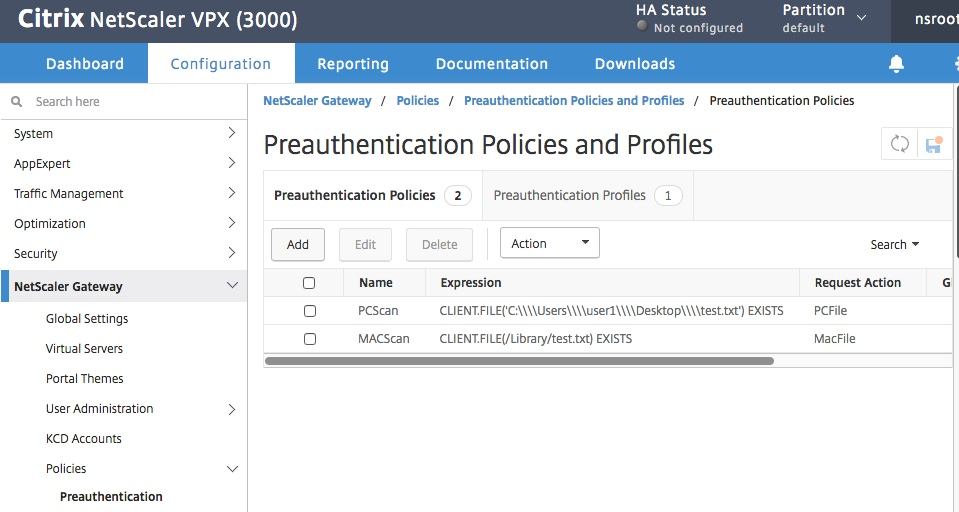
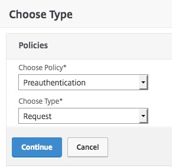
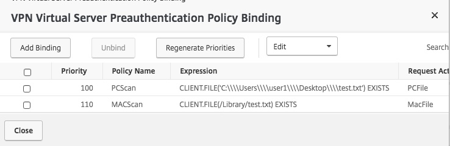

# Module 1: Setting up a Pre-Auth EPA scan policy

#Introduction

~8 min to complete and to test end user experience

We can set up a simple preAuthentication scan, which is checked before allowing the client to even see the login page. For my test here, I used NetScaler 12, and tested off a Mac, and we used a RDServer for Windows. It is easy to manipulate a file on the desktop for an example, and here we used the file test.txt in either /Library for the Mac, or C:/Users/user1/Desktop for the pc.

The policies on the NetScaler Gateway

Select which type to bind to the vServer

Bind to the vServer

## PC).
Here is the policy used for a PC Check: CLIENT.FILE('C:\\\\Users\\\\user1\\\\Desktop\\\\test.txt') EXISTS

Doing the file on the PC is simple for sure. C:/Users/user1/Desktop..... test.txt......

Testing the PC without the expected file: FAIL

Testing the PC with the expected file: PASS

----->

## MacOS).
Here is the policy used for a Mac:
CLIENT.FILE(/Library/test.txt) EXISTS

To do the file on my mac, I used the following commands in a terminal window:

	sudo touch /Library/test.txt

	sudo mv /Library/test.txt /Library/test-ish.txt

	sudo mv /Library/test-ish.txt /Library/test.txt

	sudo rm -rf /Library/test.txt

	or sudo rm -rf /Library/test-ish.txt

Testing the Mac without the expected file: FAIL

Testing the Mac with the expected file: PASS

## Exercises 

## Thank you. 

### Shortcuts
1. [Module 1: Setting up a Pre-Auth EPA scan policy](../Module1)
2. [Module 2: Setting up a Smart Control Policy](../Module2)
3. [Module 3: Setting up Smart Access](../Module3)