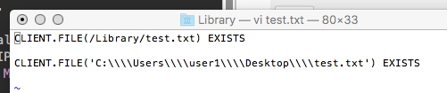
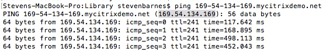

# Module 1: Setting up a Pre-Auth EPA scan policy

#Introduction

~8 min to complete and to test end user experience, given a working environment where one can log in and launch a session, and administer.

We can set up a simple preAuthentication scan, which is checked before allowing the client to even see the login page. For my test here, I used NetScaler 12, and tested off a Mac, and we used a RDServer to test Windows. It is easy to manipulate a file on the windows desktop for an example, and here we used the file test.txt in either /Library for the Mac, or C:/Users/user1/Desktop for the pc. The Mac was a little trickier, so I share the commands one could paste into a terminal window. Staying in /Library seemed important.... :).

## MacOS).

The above inage shows a policy being added for a Mac.
Here the policy used for a Mac is:
CLIENT.FILE(/Library/test.txt) EXISTS
You can use the GUI under client security, file,... to specify /Library/test.txt.

Done.

## PC).
The below image shows a policy being added for the PC.

Here is the policy used for a PC Check: * I can not write it here because the client keeps rendering it and I have to escape out. You will be good to type it in. You will want the 4 slashes, like in the screen shot. * You can use the GUI to add it as client security, file, and then type it in the 4 slashes.....    CLIENT.FILE('C:\\\\....
(I honestly typed in 4 \'s and it is showing 2 in my view of the text above. Use the picture below for an example:)

Bind the policies on the working NetScaler Gateway. Make sure your FQDN points to the vServer and VIP you add the policies to.

Select which type to bind to the vServer

Select both by doing this twice, and Bind to the vServer

## Testing the PC).

Doing the file on the PC is simple for sure. C:/Users/user1/Desktop..... test.txt......

Testing the PC without the expected file: FAIL

Testing the PC with the expected file: PASS

----->

## Testing the MacOS).

To do the file on my mac, I used the following commands in a terminal window:

	sudo touch /Library/test.txt

	sudo mv /Library/test.txt /Library/test-ish.txt

	sudo mv /Library/test-ish.txt /Library/test.txt

	sudo rm -rf /Library/test.txt

	or sudo rm -rf /Library/test-ish.txt

Testing the Mac without the expected file: FAIL

Testing the Mac with the expected file: PASS

## Exercises 

## Thank you. 

### Shortcuts
1. [Module 1: Setting up a Pre-Auth EPA scan policy](../Module1)
2. [Module 2: Setting up a Smart Control Policy](../Module2)
3. [Module 3: Setting up Smart Access](../Module3)