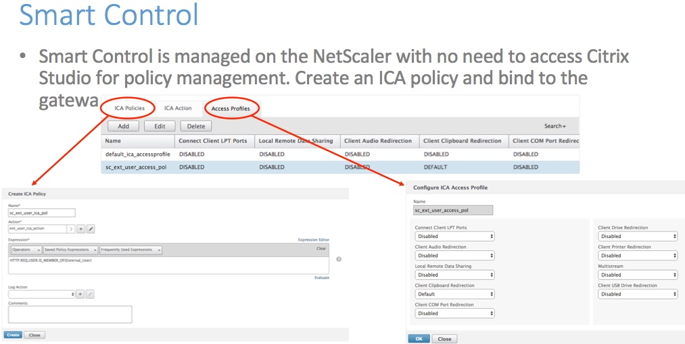
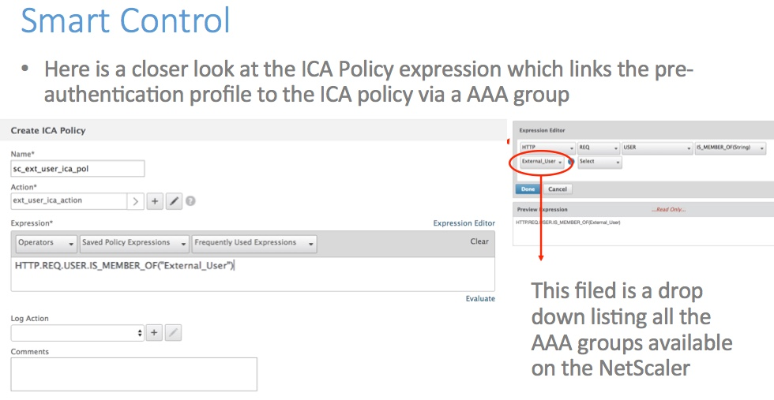
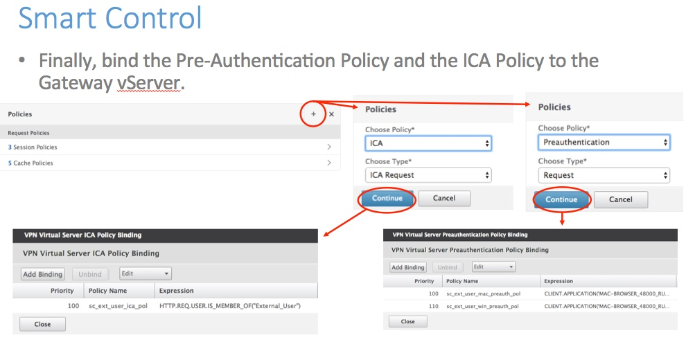
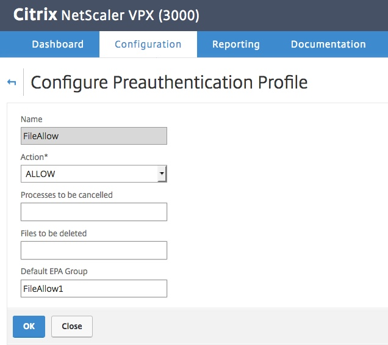
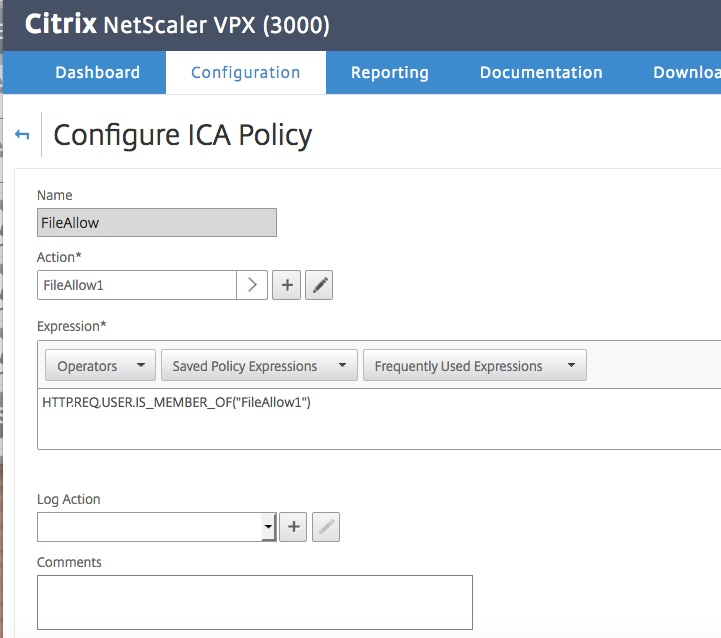
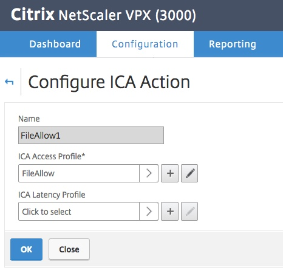
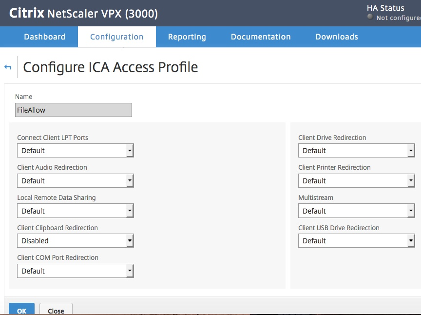
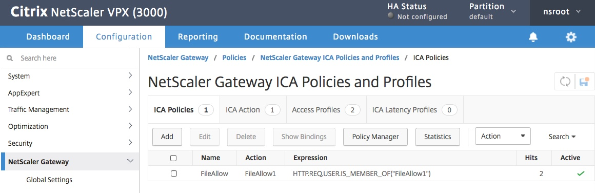

# Setting up a Smart Control Policy

#Introduction

Smart Control: Allows decisions to be made at the edge of your network, blocking access to resources when in the case of a PreAuthorization scan, the user has not even gained access into the corporate network yet.

~8 min to complete and to test end user experience, given a working environment where one can log in and launch a session, and administer.

Policy expression checks group membership based on EPA scan and blocks copy/paste and local drive redirection. Based on a EPA result match group setting, we are enforcing at the NetScaler. Get a different preauth scan result, get a different result....

## Exercises 

First, check the Default EPA Group setting from the EPA exercise before. I have "FileAllow1" below. Tweak this, or the policy, and you stop matching and enforcing.....

My ICA Policy is set to match "FileAllow1" as marked in the PreAuth EPA Scan. On matching, it sets the Action to FileAllow1. Tweak this, or the Default EPA Group setting on the PreAuth scan (above), and you stop matching and enforcing.....

My ICA Action, "FileAllow1", is set to ICA Access profile "FileAllow".

My ICA Access Profile, "FileAllow", is set to allow defaults for all but Client Clipboard Redirection, which I am marked as Disabled.

Validating and testing is as easy as watching th hts increment on the policy (Under Gateway, Policies, ICA, and by testing if you can cut/paste to and from the launched desktop. I see two hits in the image below.

## Thankyou 

### Shortcuts
1. [Module 1: Setting up a Pre-Auth EPA scan policy](../Module1)
2. [Module 2: Setting up a Smart Control Policy](../Module2)
3. [Module 3: Setting up Smart Access](../Module3)