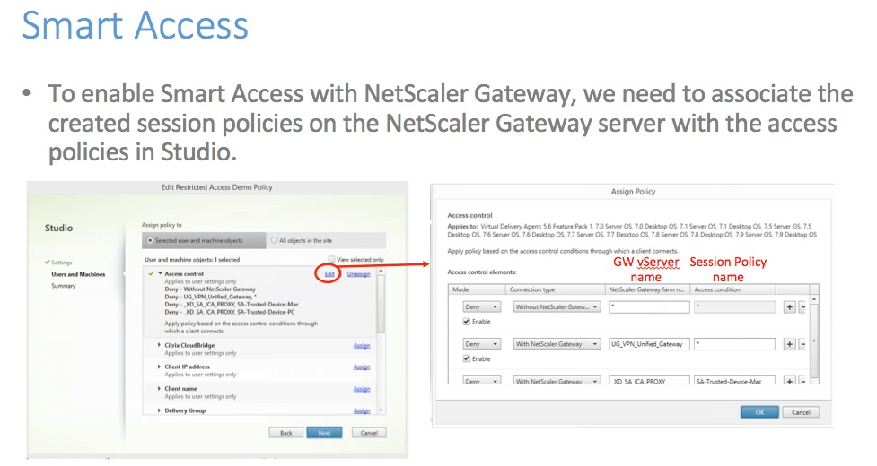
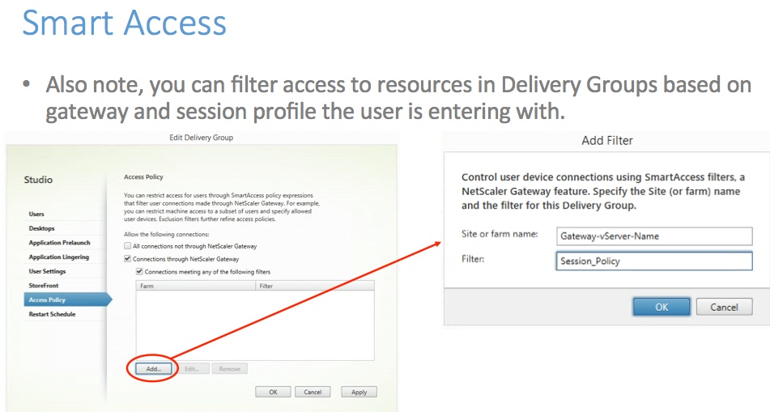

# Setting up Smart Access

# Introduction

Smart Access: ICA Session polices are triggered using SmartGroups and Endpoint Analysis (EPA) at the NetScaler Gateway, it provides greater control with network-level awareness.

~8 min to complete and to test end user experience, given a working environment where one can log in and launch a session, and administer.

Logon without it configured see your Branch VDA Desktops available.

Set up Smart Access to filter on delivery groups to hide Branch VDA Desktop if you’re logging in via GW with bound session policy and observe the hidden Branch VDA desktop.

## Exercises 

## Thankyou 

### Shortcuts
1. [Module 1: Setting up a Pre-Auth EPA scan policy](../Module1)
2. [Module 2: Setting up a Smart Control Policy](../Module2)
3. [Module 3: Setting up Smart Access](../Module3)